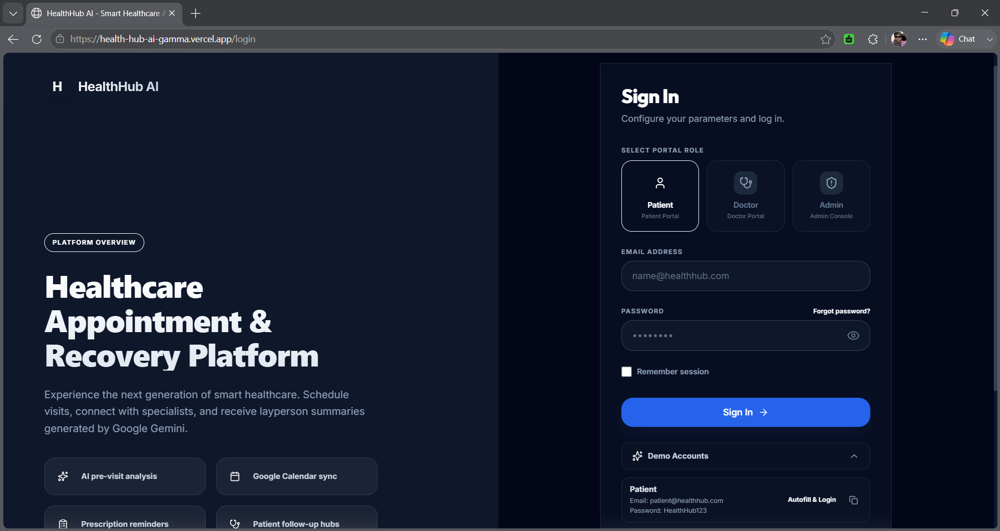
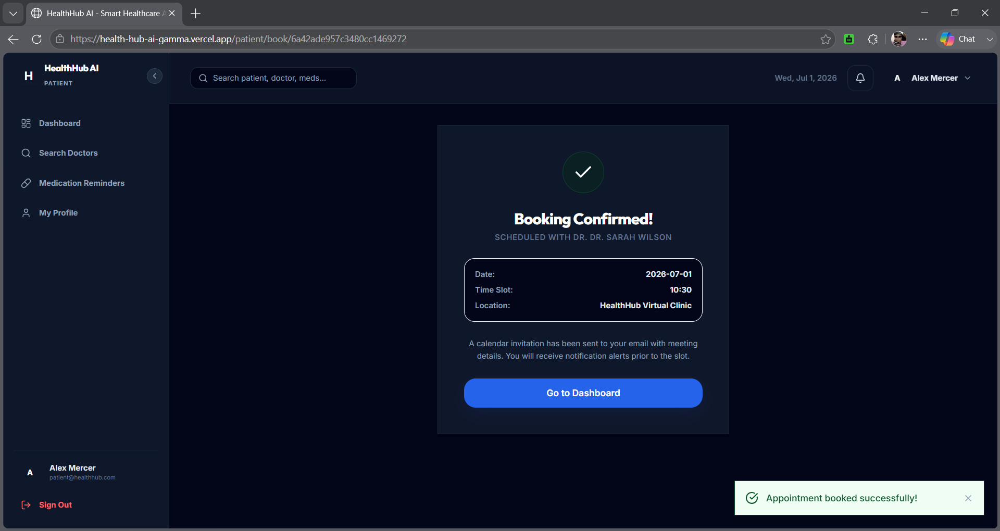
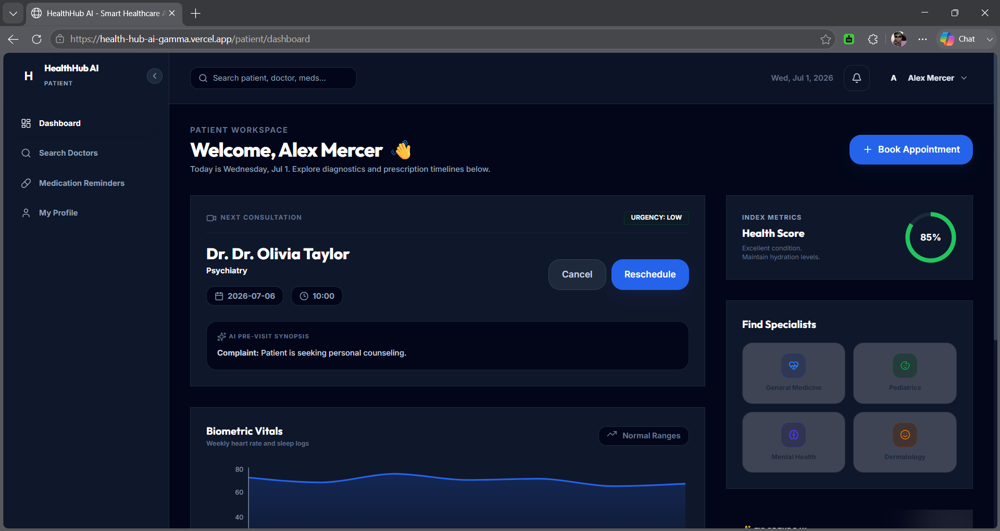
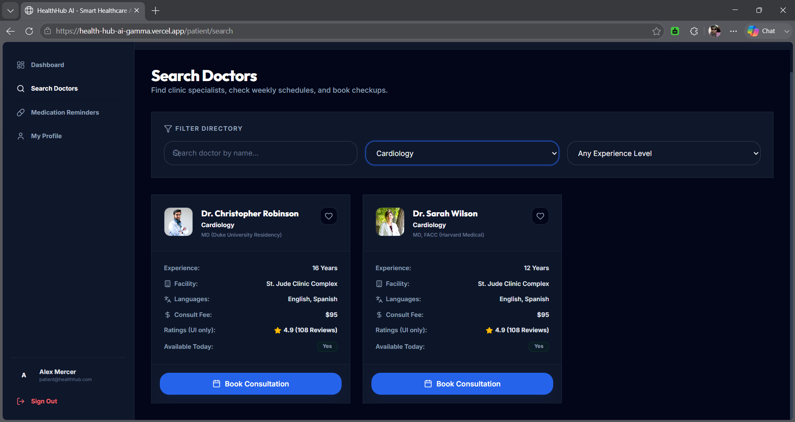
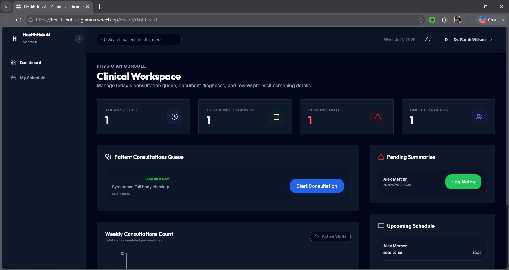
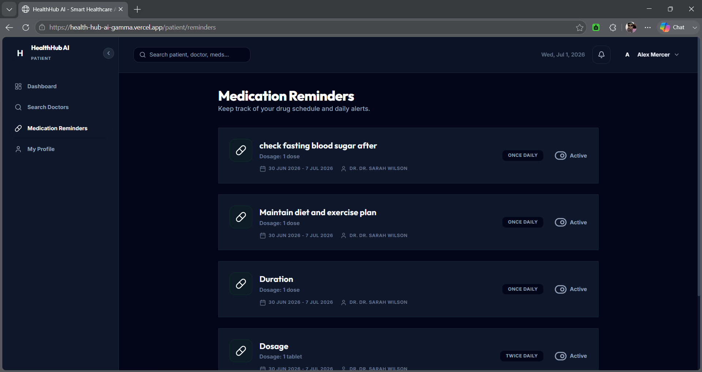
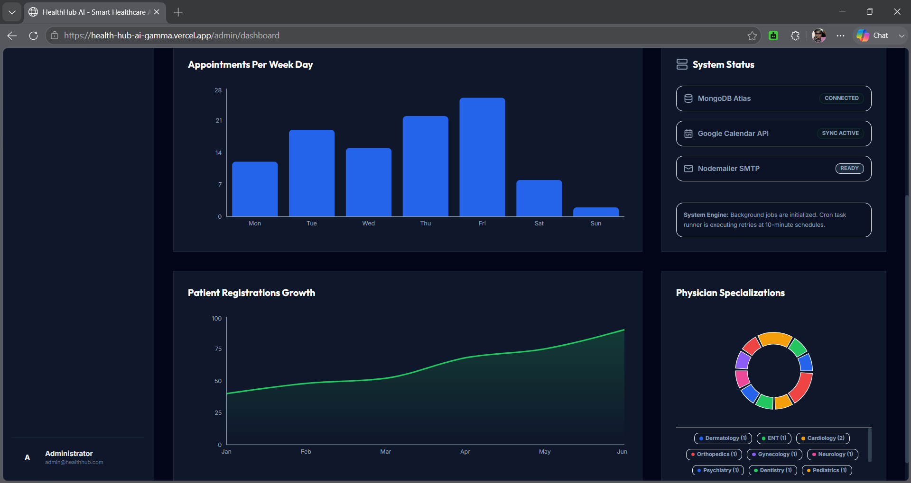

# HealthHub AI - Smart Healthcare Appointment & Follow-up Platform

HealthHub AI is a modern SaaS platform designed to optimize doctor-patient scheduling, pre-visit symptom evaluation, and post-visit recovery. By combining Google Gemini AI assisted symptom analysis with automatic Google Calendar scheduling and Node-Cron medication alerts, the platform delivers a premium, production-ready solution for digital clinics.

---


## 🚀 Live Demo

Frontend:
https://health-hub-ai-gamma.vercel.app

Backend API:
https://healthhub-ai-backend.onrender.com/health

## ✨ Key Features

- 🤖 Google Gemini AI powered pre-visit symptom analysis
- 📅 Automatic Google Calendar appointment synchronization
- 📧 Email confirmations using Nodemailer SMTP
- ⏰ Automated medication reminders with Node-Cron
- 🔐 JWT Authentication with Role-Based Access Control (Patient, Doctor, Admin)
- 👨‍⚕️ Doctor availability and appointment scheduling
- 📊 Interactive dashboards for Patients, Doctors, and Administrators
- 📈 Admin analytics with appointment and registration insights
- ☁️ Production deployment using Vercel + Render + MongoDB Atlas


## 📸 Application Preview

### Secure Authentication
  
JWT-based authentication with separate patient, doctor, and administrator portals for secure role-based access.

### AI-Powered Appointment Booking
  
Multi-step booking workflow featuring **Google Gemini** symptom analysis, urgency assessment, doctor selection, and real-time appointment scheduling.

### Patient Dashboard
  
Personalized dashboard to manage appointments, notifications, medication reminders, and healthcare activities.

### Doctor Directory
  
Browse specialists using filters for specialty, experience, and availability before booking consultations.

### Doctor Dashboard
  
Doctors can manage appointments, review AI-generated patient summaries, and monitor their consultation schedule.

### Medication Reminders
  
Track medications with automated reminders and an organized medication management interface.

### Admin Dashboard
  
Comprehensive analytics dashboard displaying appointment trends, patient growth, physician distribution, and live system health including **MongoDB**, **Google Calendar Sync**, and **SMTP Email** services.

---

## 🛠 Tech Stack

| Category | Technologies |
|----------|--------------|
| Frontend | React, Vite, Tailwind CSS |
| Backend | Node.js, Express.js |
| Database | MongoDB Atlas |
| Authentication | JWT |
| AI | Google Gemini API |
| Calendar | Google Calendar API |
| Email | Nodemailer SMTP |
| Scheduling | Node-Cron |
| Deployment | Vercel, Render |

## Folder Structure

```
HealthHub/
├── .env.example
├── README.md
├── SYSTEM_DESIGN.md
├── backend/
│   ├── src/
│   │   ├── config/          # Configurations
│   │   ├── controllers/     # Route controllers
│   │   ├── middleware/      # Protected paths, JWT, and Role guards
│   │   ├── models/          # Mongoose models
│   │   ├── routes/          # API route definitions
│   │   ├── services/        # Nodemailer, Gemini, Calendar Sync services
│   │   └── app.js           # Server index
│   └── package.json
└── frontend/
    ├── src/
    │   ├── components/      # Common UI elements
    │   ├── context/         # AuthSession & Toast global contexts
    │   ├── pages/           # Pages (Admin, Doctor, Patient portals)
    │   ├── services/        # Axios API instances
    │   ├── App.jsx          # Route layout
    │   └── index.css        # Tailwind styles & glassmorphic classes
    ├── tailwind.config.js
    └── package.json
```

---

## 🔑 Demo Credentials

### Patient
Email: patient@healthhub.com
Password: HealthHub123

### Doctor
Email: doctor@healthhub.com
Password: HealthHub123

### Admin
Email: admin@healthhub.com
Password: HealthHub123

## Setup & Installations

### Prerequisites
* Node.js (v18+)
* MongoDB Atlas cluster (or local MongoDB database instance)
* Google Cloud Console Developer account (for Calendar OAuth Client)
* Gemini API Key (obtain from Google AI Studio)

### Backend Configuration
1. Navigate to the backend directory:
   ```bash
   cd backend
   ```
2. Create your `.env` configuration file from the template:
   ```bash
   cp ../.env.example .env
   ```
3. Populate the variables in `.env` (refer to the Environment Variables section below).
4. Start the development server:
   ```bash
   npm run dev
   ```

### Frontend Configuration
1. Navigate to the frontend directory:
   ```bash
   cd ../frontend
   ```
2. Build or start the development client:
   ```bash
   npm run dev
   ```
3. Open [http://localhost:5173](http://localhost:5173) in your browser.

---

## Environment Variables

Your `.env` file should contain the following credentials:

```ini
PORT=5000
MONGODB_URI=your-mongodb-atlas-connection-string
JWT_SECRET=your-secure-jwt-signing-secret

# Google Gemini API
GEMINI_API_KEY=your-gemini-studio-api-key

# Nodemailer SMTP Configuration
EMAIL_USER=your-clinic-gmail@gmail.com
EMAIL_PASS=your-gmail-app-password

# Google Calendar API Client
GOOGLE_CLIENT_ID=your-google-oauth-client-id.apps.googleusercontent.com
GOOGLE_CLIENT_SECRET=your-google-oauth-client-secret
GOOGLE_REDIRECT_URI=your-backend-url/api/calendar/oauth2callback

Example (Local):http://localhost:5000/api/calendar/oauth2callback
Example (Production):https://your-backend.onrender.com/api/calendar/oauth2callback
```

---

## Google Calendar API Integration Walkthrough

To enable calendar syncing:
1. Go to the [Google Cloud Developer Console](https://console.cloud.google.com/).
2. Create a new Project and enable the **Google Calendar API**.
3. Set up the **OAuth Consent Screen** (specify User Type: External, and add scope `.../auth/calendar`).
4. Navigate to **Credentials** -> **Create Credentials** -> **OAuth Client ID**.
5. Select Application Type: **Web Application**.
6. Under **Authorized redirect URIs**, add `http://localhost:5000/api/calendar/oauth2callback`.
7. Retrieve your Client ID and Client Secret, and save them in the backend `.env` file.
8. Log in as an Administrator and visit `/api/calendar/auth-url` to complete clinic calendar authorization.

---


Or an even cleaner version:

```md
## 🏗 System Architecture

```text
Patient
   │
   ▼
React Frontend (Vercel)
   │
   ▼
REST API
   │
   ▼
Express.js Backend (Render)
   │
   ├── MongoDB Atlas
   ├── Google Gemini API
   ├── Google Calendar API
   ├── Nodemailer SMTP
   └── Node-Cron Scheduler

## API Documentation

### Auth Module (`/api/auth`)
* `POST /register`: Registers a patient profile.
* `POST /login`: Log in (supports role selection).
* `GET /me`: Verifies user session.

### Appointments Module (`/api/appointments`)
* `GET /slots`: Lists available slots categorized by time of day (Morning/Afternoon/Evening).
* `POST /book`: Books a slot, triggers Gemini pre-visit screening, and syncs to Google Calendar.
* `POST /reschedule/:id`: Reschedules an appointment.
* `POST /cancel/:id`: Cancels an appointment.

### Patients Module (`/api/patients`)
* `GET /dashboard`: Fetches closest upcoming appointment and active reminders.
* `GET /doctors`: Searches and filters active doctors.
* `GET /reminders`: Lists patient medication schedules.
* `PATCH /reminders/:id/toggle`: Toggles active state of a reminder.
* `PUT /profile`: Updates patient profile.

### Doctors Module (`/api/doctors`)
* `GET /dashboard`: Fetches consult queue, pending notes, and patient statistics.
* `PUT /appointments/:id/consultation`: Saves diagnosis, prescription, clinical notes, and triggers post-visit summaries.
* `PUT /profile`: Updates doctor's availability days/hours.

### Admin Module (`/api/admin`)
* `GET /stats`: Fetches system totals, recent logs, and chart metrics.
* `POST /doctors`: Creates a new physician login and profile.
* `PUT /doctors/:id`: Updates physician details (including leaves).
* `PATCH /doctors/:id/toggle`: Toggles doctor's active status.
* `DELETE /doctors/:id`: Deletes doctor profile and cancels their appointments.
* `GET /appointments`: Central calendar list of all bookings.

---

## Deployment Guide

### Database (MongoDB Atlas)
1. Set up a free-tier cluster in MongoDB Atlas.
2. In network access, allow IP connections from anywhere (`0.0.0.0/0`) for hosting providers.
3. Save the connection string in the backend environment variables.

### Backend (Render)
1. Connect your repository to [Render](https://render.com/).
2. Select **Web Service** and choose the `Node` runtime.
3. Set the build command to `npm install` and start command to `npm start`.
4. In Advanced Settings, add the environment variables from your `.env` file.

### Frontend (Vercel)
1. Import your project into [Vercel](https://vercel.com/).
2. Set the framework preset to **Vite**.
3. Set the root directory of the deployment to `frontend/`.
4. Set the build command to `npm run build` and output directory to `dist`.
5. Set `VITE_API_URL` to point to your backend Render URL.
