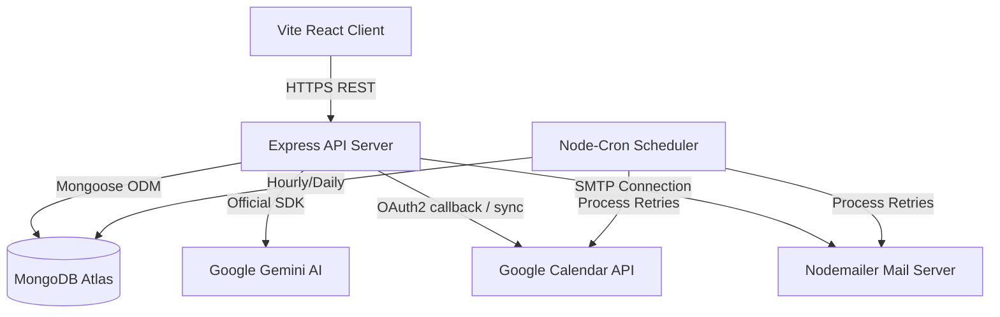

# System Design Document: HealthHub AI

This document provides a comprehensive overview of the architecture, security practices, synchronization workflows, and database models implemented in HealthHub AI.

---

## 1. System Architecture

HealthHub AI follows a modular, client-server monorepo architecture:



* **Frontend**: Built using React (Vite) styled with Tailwind CSS v4. Page routing is managed via `react-router-dom` with role-based layout templates.
* **Backend**: Node.js + Express REST API.
* **Background Runner**: Node-Cron schedules background checks for medication reminders, daily logs, and queue processing.

---

## 2. Authentication & Authorization Workflow

We enforce JWT-based, stateless authorization with role-based checkpoints:

1. **Patient Registration**: Publicly accessible. Creates a base login user and a corresponding profile in the `Patients` collection.
2. **Physician Provisioning**: Restricted. Administrator accounts can create, edit, or delete doctors.
3. **Session Verification**:
   * On login, the server returns a JWT containing the user ID and user role, which is stored in the browser's `localStorage`.
   * An Axios request interceptor automatically appends the token in the `Authorization: Bearer <token>` header for all API calls.
   * `authMiddleware.protect` validates the signature and assigns the user profile to `req.user`.
   * `authMiddleware.authorize(...roles)` blocks requests unless the user matches the specified access tier.

---

## 3. Double-Booking Prevention

To guarantee that two users cannot schedule the same physician at the same time, we implement two layers of defense:

1. **Application-level Availability Guard**:
   * Before scheduling, the appointment wizard fetches booked time slots for the chosen doctor and date.
   * In-memory UI calendar options are dynamically disabled for booked slots.
   * On form submit, the server checks if any active appointment already conflicts with the requested slot:
     ```javascript
     const slotTaken = await Appointment.findOne({ doctorId, date, time, status: { $ne: 'cancelled' } });
     ```

2. **Database-level Constraint (Unique Index)**:
   * To prevent race conditions (where two users attempt to book the same slot at the exact same millisecond), we enforce a partial unique index in Mongoose:
     ```javascript
     appointmentSchema.index(
       { doctorId: 1, date: 1, time: 1 },
       { unique: true, partialFilterExpression: { status: { $ne: 'cancelled' } } }
     );
     ```
   * Any concurrent transaction attempting to write matching active coordinates will fail with a MongoDB duplicate key exception (`code 11000`).
   * The controller traps this error and returns a clean response: `"This slot has already been booked. Please select another slot."`

---

## 4. Google Calendar Integration & OAuth Token Rotation

Google Calendar requires user consent via OAuth2. HealthHub AI uses a centralized system calendar service:

1. **Authorization**: The administrator visits `/api/calendar/auth-url`, redirects to Google's consent page, and authorizes the clinic.
2. **Redirect & Token Capture**: Google calls back to `/api/calendar/oauth2callback`, exchanges the authorization code for credentials (access token, refresh token, expiry), and saves them in the `GoogleToken` collection under owner `"system"`.
3. **Token Rotation**:
   * When making calendar API calls, the server instantiates an OAuth2 client with the saved credentials.
   * The client registers an event listener for automatic token rotation:
     ```javascript
     oauth2Client.on('tokens', async (tokens) => {
       await GoogleToken.updateOne({ ownerId: 'system' }, { $set: { accessToken: tokens.access_token, expiryDate: tokens.expiry_date } });
     });
     ```
   * If Google APIs refresh the access token internally, the system captures and updates it in the database.
4. **Operations & Attendee Sync**:
   * **Creation**: Inserts a calendar event with `sendUpdates: "all"`, listing the doctor and patient emails. This automatically invites both parties via Google Calendar.
   * **Rescheduling**: Modifies the start/end parameters.
   * **Cancellation**: Deletes the event ID.

---

## 5. Doctor Leave Date Handling

Administrators can schedule leaves for physicians. If appointments exist on the selected date:
1. The server identifies active bookings for that physician matching the leave date.
2. It updates their status to `cancelled` and sets the reason to `Doctor scheduled leave on this date`.
3. The server deletes the Google Calendar events for the bookings.
4. It sends email alerts to the patients and notifies the doctor.

---

## 6. Email Queue & Retry System

To prevent API timeouts or SMTP rate limit failures from interrupting user workflows:

1. **Queueing**: If Nodemailer or Google Calendar syncs fail during booking, rescheduling, or cancellation, the event is saved in the `SyncQueue` collection with state `'pending'` and the required payload details.
2. **Background Retry Job**: A cron job runs every 10 minutes, retrieving pending tasks.
3. **Exponential Backoff**:
   * If a task fails again, its `attempts` count increases.
   * The next run time (`runAfter`) is delayed exponentially: `attempts * 5` minutes.
   * Once attempts exceed `maxAttempts` (default 5), the task is marked as `'failed'` for manual admin review.

---

## 7. Gemini AI Prompts & Integration

We integrate Gemini (`gemini-1.5-flash`) for clinical assistance:

### Pre-Visit Screening
* **Trigger**: Booking an appointment.
* **Prompt**:
  ```
  Analyze these symptoms and return:
  * urgency level
  * chief complaint
  * three suggested questions for the doctor
  ```
* **Payload**: Structured JSON response, parsed and saved to the appointment file.
* **Resilience**: If Gemini is rate-limited, offline, or returns invalid JSON, the server intercepts the exception, applies a predefined fallback summary, and saves the booking to ensure the patient's appointment is scheduled.

### Post-Visit Layperson Summary
* **Trigger**: Physician completes consultation notes.
* **Prompt**:
  ```
  Convert these clinical notes into a patient-friendly summary with:
  * diagnosis explanation
  * medication schedule
  * precautions
  * follow-up instructions
  ```
* **Medication Extraction**: The server parses the prescription notes, identifies dosage, medicine names, and frequencies (Morning, Night, Once Daily, Twice Daily), and schedules daily reminders in the database.
